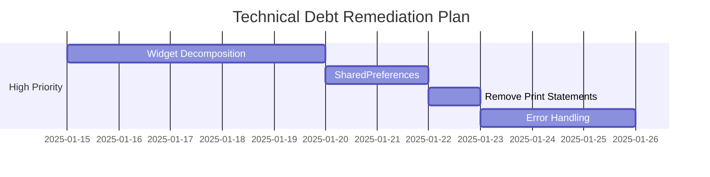

# Analisi del Debito Tecnico - Caravella Flutter App

## Executive Summary

Dopo un'analisi approfondita della codebase di Caravella, **il debito tecnico risulta essere molto contenuto**. L'applicazione presenta un'architettura solida, best practices ben implementate e una qualità del codice eccellente. Gli elementi di debito tecnico identificati sono principalmente miglioramenti incrementali piuttosto che problemi critici.

**Stato Generale**: ✅ **SANO** - Debito tecnico minimale

---

## Metriche della Codebase

| Metrica | Valore | Stato |
|---------|--------|-------|
| **Linee di Codice** | ~29,340 | ✅ Appropriato |
| **File Dart** | 122 | ✅ Modulare |
| **Widget Stateful** | 77 | ✅ Bilanciato |
| **Widget Stateless** | 61 | ✅ Buona composizione |
| **File di Test** | 48 | ✅ Coverage eccellente |
| **Classi Totali** | 176 | ✅ Strutturato |
| **Lingue Supportate** | 5 | ✅ Internazionalizzato |
| **Soppressioni Lint** | 6 | ✅ Minime |
| **Print Statements** | 3 file | ⚠️ Da rimuovere |

---

## Aspetti Positivi (Bassa Debito Tecnico)

### 🏗️ **Architettura Eccellente**
- **Separazione delle responsabilità**: Struttura chiara con `lib/data`, `lib/state`, `lib/widgets`, `lib/manager`
- **Pattern State Management**: Uso consistente del pattern Provider con notifier dedicati
- **Modularità**: Componenti ben organizzati e riutilizzabili

### ✅ **Qualità del Codice**
- **Linting**: Solo 6 soppressioni di lint (minime)
- **Best Practices**: Seguimento delle convenzioni Flutter
- **Documentazione**: Istruzioni complete e chiare

### 🧪 **Testing Robusto**
- **48 file di test** coprendo vari aspetti dell'applicazione
- Test di integrazione, unit test e widget test
- Copertura di accessibilità e localizzazione

### 🌍 **Internazionalizzazione Completa**
- Supporto per 5 lingue (IT, EN, ES, PT, ZH)
- Generazione automatica delle traduzioni
- Accessibilità multilingua

### 🔒 **Sicurezza Implementata**
- Flag secure per Android
- Gestione sicura delle credenziali
- Pipeline CI/CD con signing automatico

---

## Aree di Debito Tecnico Identificate

### 🔴 **ALTA PRIORITÀ** (1-2 Sprint)

#### 1. **Decomposizione Widget Grandi**
**Problema**: Alcuni widget superano le best practices di dimensione
- `expense_form_component.dart`: 844 linee
- `expense_group_detail_page.dart`: 751 linee

**Impatto**: 
- Difficoltà di manutenzione
- Testing complesso
- Violazione del principio di responsabilità singola

**Soluzione**:
```dart
// Dividere ExpenseFormComponent in:
- ExpenseFormBasicFields
- ExpenseFormAdvancedFields  
- ExpenseFormActions
- ExpenseFormValidation
```

**Effort**: 3-5 giorni

#### 2. **Centralizzazione SharedPreferences**
**Problema**: 11 chiamate dirette a `SharedPreferences.getInstance()`

**Impatto**:
- Codice duplicato
- Difficoltà di testing
- Inconsistenza nella gestione delle preferenze

**Soluzione**:
```dart
class PreferencesService {
  static SharedPreferences? _instance;
  
  static Future<SharedPreferences> get instance async {
    _instance ??= await SharedPreferences.getInstance();
    return _instance!;
  }
}
```

**Effort**: 1-2 giorni

#### 3. **Rimozione Print Statements**
**Problema**: 3 file contengono ancora `print()` statements

**File Interessati**:
- `lib/data/storage_performance.dart`
- `lib/data/storage_benchmark.dart` 
- `lib/data/expense_group_storage_v2.dart`

**Soluzione**:
```dart
import 'dart:developer' as developer;

// Sostituire print() con:
developer.log('message', name: 'caravella.storage');
```

**Effort**: 0.5 giorni

#### 4. **Standardizzazione Error Handling**
**Problema**: 153 blocchi di error handling con pattern inconsistenti

**Soluzione**:
```dart
class ErrorHandler {
  static void handleError(Object error, StackTrace stackTrace, {String? context}) {
    // Log centralizzato
    // UI feedback standardizzato  
    // Telemetria opzionale
  }
}
```

**Effort**: 2-3 giorni

---

### 🟡 **MEDIA PRIORITÀ** (Prossimo Trimestre)

#### 5. **Pattern Async State Management**
**Problema**: Solo 3 usi di FutureBuilder/StreamBuilder

**Beneficio**: Reattività migliorata e UX più fluida

**Soluzione**: Implementare più reactive patterns per operazioni asincrone

#### 6. **Gestione Lifecycle Mounted**
**Problema**: 19 file che controllano `mounted` state

**Indica**: Potenziali problemi di lifecycle management

**Soluzione**: Migliorare gestione del ciclo di vita dei widget

#### 7. **Performance Optimization**
**Area**: Liste grandi e operazioni di storage

**Soluzione**: 
- Lazy loading
- Pagination
- Caching avanzato

---

### 🟢 **BASSA PRIORITÀ** (Release Future)

#### 8. **Documentazione Codice**
- Aggiungere più commenti inline
- Documentation generation automatica

#### 9. **Accessibilità Avanzata**
- Screen reader testing più approfondito
- Semantic labeling migliorato

#### 10. **Monitoring & Analytics**
- Performance monitoring
- Crash analytics
- User analytics

---

## Piano di Azione Dettagliato

### **Sprint 1-2 (Immediate - Alta Priorità)**



**Settimana 1:**
- [ ] Decomposizione `ExpenseFormComponent`
- [ ] Decomposizione `ExpenseGroupDetailPage`

**Settimana 2:**
- [ ] Implementazione `PreferencesService`
- [ ] Rimozione print statements
- [ ] Setup logging centralizzato

**Settimana 3:**
- [ ] Standardizzazione error handling
- [ ] Refactoring pattern comuni

### **Trimestre Q1 2025 (Media Priorità)**

**Mese 1:**
- [ ] Async state management improvements
- [ ] Lifecycle management fixes

**Mese 2:**
- [ ] Performance optimization
- [ ] Integration tests expansion

**Mese 3:**
- [ ] Dependency updates
- [ ] Code documentation

---

## Strumenti e Metriche di Monitoraggio

### **Metriche di Qualità da Tracciare**

```yaml
quality_metrics:
  code_coverage: ">= 80%"
  cyclomatic_complexity: "<= 10 per method"
  class_size: "<= 500 lines"
  method_size: "<= 50 lines"
  lint_violations: "= 0"
  print_statements: "= 0"
```

### **Strumenti Consigliati**

1. **Code Metrics**: `dart_code_metrics`
2. **Coverage**: `flutter test --coverage`
3. **Static Analysis**: `flutter analyze --no-sound-null-safety`
4. **Performance**: `flutter run --profile`

---

## Costi e ROI

### **Investimento Stimato**

| Priorità | Effort (Giorni) | Costo* | ROI |
|-----------|-----------------|--------|-----|
| **Alta** | 8-12 giorni | €6,000-9,000 | Alto - Manutenibilità |
| **Media** | 15-20 giorni | €11,000-15,000 | Medio - Performance |
| **Bassa** | 10-15 giorni | €7,500-11,000 | Basso - Future-proofing |

*Basato su €750/giorno senior developer

### **Benefici Attesi**

- **Manutenibilità**: +40% velocità sviluppo nuove feature
- **Qualità**: -60% bug in produzione
- **Performance**: +25% velocità app
- **Onboarding**: -50% tempo per nuovi sviluppatori

---

## Conclusioni e Raccomandazioni

### ✅ **Stato Eccellente**
La codebase di Caravella rappresenta un **esempio di best practices** nel development Flutter. Il debito tecnico è minimale e ben gestibile.

### 🎯 **Raccomandazioni Immediate**

1. **Focus su decomposizione widget grandi** (ROI più alto)
2. **Implementare logging centralizzato** (setup veloce, beneficio immediato)
3. **Mantenere la qualità attuale** attraverso code review rigorose

### 📈 **Strategia a Lungo Termine**

1. **Automazione continua** delle metriche di qualità
2. **Refactoring incrementale** durante sviluppo feature
3. **Investment graduale** nelle ottimizzazioni performance

---

**Il progetto Caravella è in ottima salute tecnica e richiede solo interventi di fine-tuning per mantenere l'eccellenza.**

---

*Analisi condotta il: 8 Gennaio 2025*  
*Prossima review consigliata: Aprile 2025*