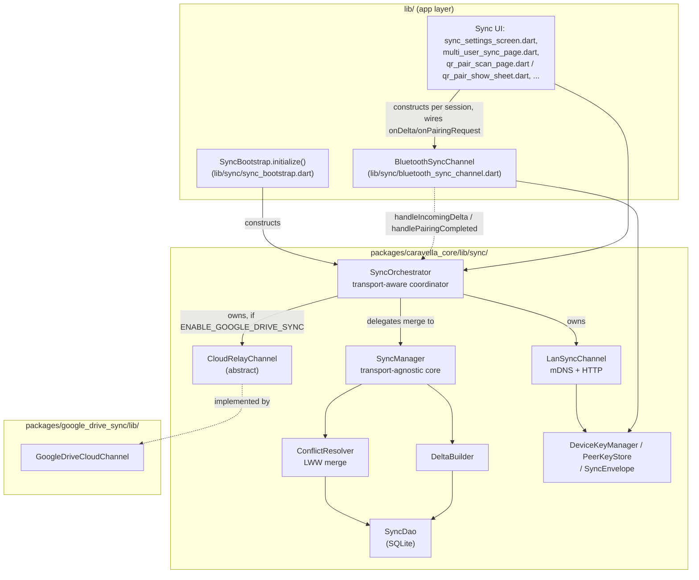
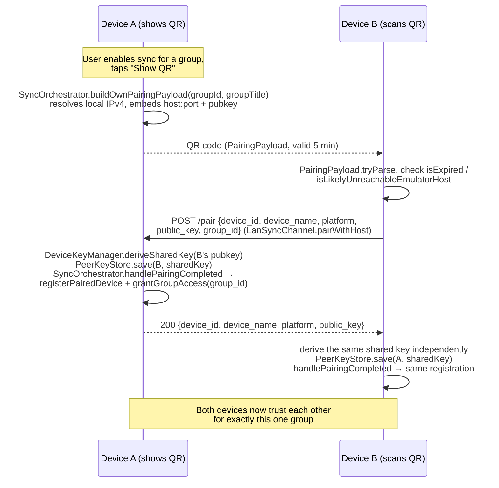

# Sync Architecture

Caravella's P2P sync lets a user exchange group/expense data directly between *their own* devices (or with someone else's, for a shared group) — over LAN, Bluetooth, or an optional Google Drive relay — with no backend server. This page documents how the ~6,700 lines across three channel implementations, the shared sync engine, and the app-level UI fit together; it's the missing piece the [Architecture Overview](ARCHITECTURE.md#feature-map-where-to-look) feature-map row previously just pointed at source directories for.

Read this after [caravella_core reference](PACKAGE_CARAVELLA_CORE.md) and, if you're touching the cloud channel specifically, [google_drive_sync package](PACKAGE_GOOGLE_DRIVE_SYNC.md) (which covers that one channel's internals in more depth and isn't repeated here).

## Layering



`BluetoothSyncChannel` is deliberately **not** owned by `SyncOrchestrator` the way `LanSyncChannel`/`CloudRelayChannel` are — it's constructed fresh per pairing/sync session by UI code (`lib/sync/multi_user_sync_page.dart:206-208`, `lib/manager/details/pages/expense_group_sync_page.dart:104-106`) and pointed at the same orchestrator instance via two public methods that exist specifically for this: `SyncOrchestrator.handleIncomingDelta` and `.handlePairingCompleted` (`packages/caravella_core/lib/sync/sync_orchestrator.dart:359-388`). This is why those two methods are public despite everything else being routed through private helpers.

## Components

| Component | File | Role |
|---|---|---|
| `SyncOrchestrator` | `packages/caravella_core/lib/sync/sync_orchestrator.dart` | Single entry point the UI/DI talk to. Owns `LanSyncChannel` + optional `CloudRelayChannel`, merges their event streams, exposes pairing (`buildOwnPairingPayload`/`pairWithScannedPayload`), manual sync (`triggerManualSync`), and history (`getHistory`). |
| `SyncManager` | `packages/caravella_core/lib/sync/sync_manager.dart` | Transport-agnostic core — doc comment explicitly says transport channels are "not part of this class." Owns `DeltaBuilder` + `ConflictResolver`, exposes `syncWithPeer`/`getOutgoingDelta` and all paired-device/grant CRUD (thin `SyncDao` passthroughs). |
| `ConflictResolver` | `packages/caravella_core/lib/sync/conflict_resolver.dart` | Applies an incoming delta with Last-Writer-Wins semantics inside one DB transaction; independently re-verifies the per-group grant before writing anything (see [Trust model](#trust-model-per-channel)). |
| `DeltaBuilder` | `packages/caravella_core/lib/sync/delta_builder.dart` | Builds the outgoing delta for a peer: every `sync_enabled` group changed since the last recorded sync *with that peer* and granted to it, each as a **full group snapshot**, not a field-level diff. |
| `SyncDao` | `packages/caravella_core/lib/sync/sync_dao.dart` | SQLite query layer over the sync tables added to the same DB `SqliteExpenseGroupRepository` uses (see [Storage](#storage-sqlite-schema) below). |
| `LanSyncChannel` | `packages/caravella_core/lib/sync/channels/lan_sync_channel.dart` | mDNS discovery (`bonsoir`) + an embedded `shelf`/`shelf_router` HTTP server (`/pair`, `/sync/delta`, `/sync/ping`) for the actual exchange. |
| `BluetoothSyncChannel` | `lib/sync/bluetooth_sync_channel.dart` | Manual-only (never auto-syncs) Nearby Connections channel. Same pairing philosophy as LAN (public-key handshake, per-group grant) but the *advertiser* unilaterally decides which group is on offer — see `_handleHello`, `lib/sync/bluetooth_sync_channel.dart:771-818`. Has its own chunking (32 KB payload limit, capped reassembly buffer, timeouts) since Nearby Connections payloads are smaller than a typical HTTP body. |
| `CloudRelayChannel` (abstract) → `GoogleDriveCloudChannel` | `packages/caravella_core/lib/sync/channels/cloud_relay_channel.dart` → `packages/google_drive_sync/lib/src/google_drive_cloud_channel.dart` | Interface lives in `caravella_core` so it stays independent of any concrete cloud SDK; the Google Drive implementation lives in its own conditional package. Full detail: [google_drive_sync package](PACKAGE_GOOGLE_DRIVE_SYNC.md). |
| `DeviceKeyManager` / `PeerKeyStore` / `SyncEnvelope` | `packages/caravella_core/lib/sync/crypto/` | X25519 keypair (generated once, persisted), ECDH+HKDF-SHA256 shared-key derivation, AES-256-GCM envelope encrypt/decrypt. Shared by LAN and Bluetooth; the cloud channel doesn't use this at all (see [Trust model](#trust-model-per-channel)). |
| `DeviceIdentity` | `packages/caravella_core/lib/sync/device_identity.dart` | `{deviceId (persisted UUID v4), deviceName (re-resolved via device_info_plus every launch, not persisted), platform}`. Singleton, `initialize()` must run once before use — done in `SyncBootstrap.initialize()` before `SyncOrchestrator` is constructed. |
| `SyncClock` | `packages/caravella_core/lib/sync/utils/sync_clock.dart` | The single source of truth for sync timestamps, always UTC — used instead of `DateTime.now()` everywhere in this subsystem so LWW comparisons can't break because two devices are in different timezones. |

## App wiring: `SyncBootstrap`

`lib/sync/sync_bootstrap.dart` runs once at startup (from a `FutureProvider`, so LAN mDNS/HTTP setup doesn't block first paint):

```dart
SyncOrchestrator(
  lanChannel: LanSyncChannel(),
  syncManager: SyncManager(repository: repository),
  cloudChannel: GoogleDriveSyncFactory.createCloudChannel(), // null unless ENABLE_GOOGLE_DRIVE_SYNC=true
)
```

Sync is unavailable entirely if the app is running on the legacy JSON storage backend (`--dart-define=USE_JSON_BACKEND=true` — see [Storage Backend](STORAGE_BACKEND.md)): `SyncBootstrap.initialize()` returns `null` in that case (`lib/sync/sync_bootstrap.dart:17-21`), because `SyncDao` depends on SQLite-specific columns/tables that don't exist on the JSON repository.

## Storage: SQLite schema

`SyncDao` reads/writes five things, all added as additive migrations on the same database `SqliteExpenseGroupRepository` owns (see [Storage Backend](STORAGE_BACKEND.md) for the full migration history):

| Table / columns | Added at | Purpose |
|---|---|---|
| `groups.device_id, updated_at, deleted, sync_version, sync_enabled` | schema v3 | Sync metadata bolted onto the existing groups table. `sync_enabled` is the privacy boundary — a group must be explicitly marked shared before any of its data is eligible to leave the device, on **any** channel. |
| `device_meta` (`device_id` PK, `device_name`, `last_seen`, `vector_clock`) | v3 | Last-seen bookkeeping per peer. `vector_clock` exists but is currently unused — `SyncDao.upsertDeviceMeta` always passes `null` for it. |
| `sync_log` (autoincrement id, `peer_id`, `channel`, `synced_at`, `delta_sent`, `delta_recv`) | v3 | Append-only exchange log; backs both `lastSyncTime` and the sync-history UI. |
| `paired_devices` (`device_id` PK, `device_name`, `platform`, `paired_at`, `public_key`) | v4 (`public_key` added v5) | Device identity + trust. `public_key` is nullable for pairings created before E2E encryption existed — every sync path explicitly rejects such a device rather than falling back to plaintext. |
| `paired_device_groups` (`device_id`, `group_id`, `granted_at`, composite PK) | v5 | Per-group access grant — a second, narrower boundary on top of `paired_devices`. **Being paired grants nothing by itself** (see below). |

`SyncDao.isGroupSynced`/`getAllGroupSyncStatuses` compare a group's `updated_at` against the **global** max `synced_at` in `sync_log`, not a per-peer one — since a full delta exchange updates every shared group at once, one successful sync with *any* peer is treated as bringing every shared group current. Practical effect: the sync-status badge can't distinguish "synced with peer X" from "synced with peer Y."

## The delta shape

`DeltaBuilder.buildDelta` (`packages/caravella_core/lib/sync/delta_builder.dart:40-100`) produces:

```json
{
  "device_id": "...",
  "device_name": "...",
  "timestamp": 1234567890,
  "groups": [ /* full ExpenseGroup.toJson() output, each with an added "_sync" block: device_id, updated_at, sync_version */ ],
  "deleted_groups": [ { "id": "...", "updated_at": 1234567890 } ]
}
```

This is a **full-snapshot-per-changed-group** delta, not a field-level diff — every entry in `groups` is the entire group (participants, categories, expenses, attachments) as of now, not just what changed. `ConflictResolver._saveGroupInTransaction` (`packages/caravella_core/lib/sync/conflict_resolver.dart:268-351`) applies it the same way: replace the group row, delete-and-reinsert every child row. There is no field-level merge anywhere in this pipeline.

Inclusion in a delta requires all three: changed since the last recorded sync *with that specific peer*, `sync_enabled = 1`, and explicitly granted to that peer (`SyncDao.getGroupsDeltaSince`/`getDeletedGroupsSince`, `packages/caravella_core/lib/sync/sync_dao.dart:37-80`).

## Conflict resolution: Last-Writer-Wins

`ConflictResolver.applyDelta` (`packages/caravella_core/lib/sync/conflict_resolver.dart:35-234`), one DB transaction per call:

1. No local row for this group → upsert unconditionally (new group).
2. Local row exists → compare incoming `_sync.updated_at` against the local `groups.updated_at`:
   - Remote newer → overwrite (upsert).
   - **Tie or local newer → skip.** A tie means **local wins** (`conflict_resolver_test.dart:244`, `'same timestamp — local wins (tie-break)'`).
3. Deletions follow the identical comparison, applied as a soft delete (`deleted = 1`) rather than a row removal.
4. Deleting a group this device never saw is a no-op.

**Independent grant re-check** (`_isGrantedInTxn`, `packages/caravella_core/lib/sync/conflict_resolver.dart:245-258`): before writing *any* upsert or deletion, `ConflictResolver` re-queries `paired_device_groups` itself, inside the same transaction — it does not trust that the sender only ever includes groups it was granted. An ungranted group is rejected and counted as an error, not silently skipped. This is defense-in-depth on top of the query-level filtering `DeltaBuilder` already does on the *sending* side, so a compromised or buggy sender can't push a group the receiver never granted.

## Trust model per channel

Pairing and group access are two separate, independently-enforced boundaries everywhere in this subsystem — confirmed by `SyncManager.registerPairedDevice`'s own doc comment: *"This establishes identity and encryption key material only — it does not grant access to any group"* (`packages/caravella_core/lib/sync/sync_manager.dart:148-150`), and by the test named `'remote group is rejected when the peer was never granted access to it — even though pairing exists, being paired alone grants nothing'` (`packages/caravella_core/test/sync/conflict_resolver_test.dart:128-129`).

- **LAN**: pairing is a QR-code exchange (see [Pairing flow](#pairing-flow-qr-code-lan) below) scoped to exactly the one group the QR was generated for. Auto-sync afterward (mDNS rediscovery) is gated only on `SyncManager.isPeerPaired` (device-level) — the per-group grant check happens later, inside `ConflictResolver`.
- **Bluetooth**: same pairing mechanics (X25519 handshake, per-group grant), but manual only — never auto-discovers-and-syncs the way LAN does. The connecting device has no say in which group it's granted; whichever group the advertiser passed to `startAdvertising(groupId, ...)` is what gets shared.
- **Cloud (Google Drive)**: **no pairing/trust step at all.** Trust is delegated entirely to the signed-in Google account — the channel only ever reads/writes that account's own private `appDataFolder`. There is no `SyncDao`/`ConflictResolver` per-group-grant check anywhere in this path; `downloadAllShards()` returns every shard file the account owns, full stop. This is architecturally consistent with the feature's framing ("sync your own devices via your own Google account"), but it does mean the `sync_enabled` per-group flag is the *only* gate on the cloud path — there's no second, per-peer boundary the way LAN/Bluetooth have.

Encryption (`DeviceKeyManager`/`PeerKeyStore`/`SyncEnvelope`) is LAN+Bluetooth only. Cloud relies on Drive's own transport security (HTTPS) plus the `appDataFolder` scope being invisible to every app but this one — there's no additional app-level encryption layer on top for the cloud path.

## Pairing flow (QR code, LAN)



Bluetooth pairing is the same idea with a different transport: an unencrypted `hello`/`hello_ack` handshake over Nearby Connections (`lib/sync/bluetooth_sync_channel.dart:394-463` connecting side, `:771-818` advertising side) instead of QR + HTTP — the key exchange and grant-writing steps afterward are identical.

## Delta sync flow (already-paired devices, LAN)

```mermaid
sequenceDiagram
    participant A as Device A (initiator)
    participant B as Device B

    A->>A: mDNS resolves B; isPeerAuthorized(B) check;<br/>GET /sync/ping
    A->>A: PeerKeyStore.get(B) — abort with a<br/>"re-pair required" log if no key on file
    A->>A: build outgoing delta (DeltaBuilder, see above)<br/>SyncEnvelope.encrypt
    A->>B: POST /sync/delta {envelope}
    B->>B: isPeerAuthorized(A) check; SyncEnvelope.decrypt;<br/>ConflictResolver.applyDelta (LWW merge, grant re-check)
    B->>B: build its own outgoing delta for A; encrypt
    B-->>A: 200 {envelope}
    A->>A: decrypt; ConflictResolver.applyDelta<br/>(same LWW merge, on A's side)
    Note over A,B: One HTTP round trip achieves<br/>bidirectional convergence
```

Confirmed by the integration test titled `'two devices converge after bidirectional sync'` (`packages/caravella_core/test/sync/sync_integration_test.dart:100`).

## Known gaps / TODOs

- **The Google Drive channel currently only downloads, never uploads, at runtime.** `GoogleDriveCloudChannel.uploadShard` and the `LocalJsonStore`/`GroupSerializer` machinery it would use are fully implemented and unit-tested in isolation, but nothing calls `uploadShard` from `SyncOrchestrator`, any UI page, or the periodic-polling `start()` loop — verified by grepping every call site in the repo. Worse: the shards `downloadAllShards()` does fetch are never merged into the local DB either — `SyncOrchestrator.initialize`'s `onShards` callback for the cloud channel only logs the count (`packages/caravella_core/lib/sync/sync_orchestrator.dart:114-120`). As shipped, the cloud channel doesn't move data in either direction end-to-end; treat it as inert until this is wired up, not as a third peer to LAN/Bluetooth.
- **`SyncManager.syncWithPeer` is always called with the channel name hard-coded to `'lan'`** inside `SyncOrchestrator._handleDelta` (`packages/caravella_core/lib/sync/sync_orchestrator.dart:402`), even when the delta arrived via `handleIncomingDelta` from `BluetoothSyncChannel`. So the `sync_log.channel` column (and anything reading it) will record Bluetooth-originated exchanges as `'lan'`. This doesn't affect the `SyncResult` a Bluetooth sheet shows the user directly — `BluetoothSyncChannel.syncWithPeer` tags its own returned `SyncResult.channel` correctly as `'nearby'` — the discrepancy is specifically in the `sync_log` table.
- Chunking/timeouts are Bluetooth-specific (32 KB max payload, ~128 MB reassembly cap, 15s handshake / 30s response timeouts — see `lib/sync/bluetooth_sync_channel.dart`). LAN relies on a single HTTP body; Cloud on a single Drive file per device — neither has (or currently needs) analogous limits.

## See also

- [Architecture Overview](ARCHITECTURE.md) — package boundaries, app startup sequence
- [caravella_core reference](PACKAGE_CARAVELLA_CORE.md) — the rest of `caravella_core`, including storage
- [google_drive_sync package](PACKAGE_GOOGLE_DRIVE_SYNC.md) — the cloud channel implementation in depth
- [Storage Backend](STORAGE_BACKEND.md) — full SQLite schema/migration history, including the sync-specific migrations summarized above
- [Testing Guide](TESTING.md) — where sync tests live (`packages/caravella_core/test/sync/`) and how to run them
